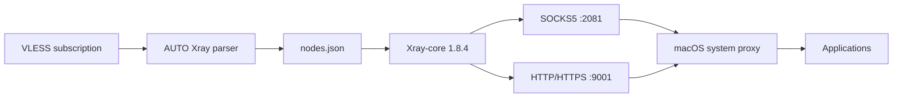

<p align="center">
  
</p>

<h1 align="center">AUTO Xray</h1>

<p align="center">
  Легкий VLESS/Reality-клиент для старых Intel Mac, которым современные клиенты уже не подходят.
</p>

<p align="center">
  
  
  
  
</p>

> **Проверено на реальном Mac:** Intel `x86_64` + macOS Catalina 10.15.x.  
> Для Apple Silicon (M1/M2/M3/M4) этот релиз не предназначен.

## Скачать

**Текущая стабильная версия: AUTO Xray 2.5.7**

[**Скачать DMG — рекомендуется**](https://github.com/eigenheit/auto-xray/releases/download/v2.5.7/AUTO_Xray_Catalina_v2.5.7.dmg)

Резервный вариант: [ZIP-инсталлятор](https://github.com/eigenheit/auto-xray/releases/download/v2.5.7/AUTO_Xray_Catalina_Installer_v2.5.7.zip) · [SHA256SUMS.txt](https://github.com/eigenheit/auto-xray/releases/download/v2.5.7/SHA256SUMS.txt)

Не скачивайте AUTO Xray с посторонних сайтов и файловых обменников.

## Что умеет

- VLESS + Reality через встроенный **Xray-core 1.8.4**;
- автоматический выбор наиболее быстрого доступного узла внутри групп **RF / EU / World**;
- ручной выбор конкретного сервера;
- HTTP/HTTPS proxy `127.0.0.1:9001` и SOCKS5 `127.0.0.1:2081`;
- автоматическая настройка системного proxy macOS;
- восстановление соединения после отключения и повторного подключения Wi-Fi;
- защита от зависших локальных proxy после выключения клиента;
- обновление VLESS-подписки прямо из меню;
- запуск из строки меню и автоматический старт после входа в macOS;
- сохранение подписки, HWID и настроек при обновлении программы.

AUTO Xray работает как **system proxy client**, а не как TUN/Network Extension VPN. Приложения, которые игнорируют системные proxy-настройки macOS, могут не использовать AUTO Xray.

## Установка через DMG

1. Скачайте `AUTO_Xray_Catalina_v2.5.7.dmg`.
2. Откройте DMG и найдите **Install AUTO Xray.app**.
3. Выполните `Control + клик → Open / Открыть`.
4. На Catalina первое предупреждение может **не дать открыть приложение** и показать только **Move to Trash / Переместить в Корзину** и **Cancel / Отменить**. Нажмите **Cancel / Отменить**.
5. Повторите `Control + клик → Open / Открыть` на **Install AUTO Xray.app**.
6. Появится второе системное предупреждение, уже с кнопкой **Open / Открыть**. Нажмите ее.
7. Установка начнется автоматически. После завершения в строке меню появится голубь **🕊**.

После установки AUTO Xray находится в состоянии **OFF**, поэтому обычный интернет должен работать напрямую.

Подробная инструкция: [docs/INSTALLATION.md](docs/INSTALLATION.md).

## Первый запуск

Нажмите **🕊** и выполните:

1. **Обновить подписку** → вставьте HTTPS-ссылку вашей VLESS-подписки.
2. Выберите **Автовыбор · RF**, **Автовыбор · EU**, **Автовыбор · World** или конкретный сервер через **Ручной выбор**.
3. Нажмите **Включить**.

Яркий голубь **🕊** означает `ON`, полупрозрачный — `OFF`.

## Как это работает



AUTO Xray следит за состоянием Xray и системного proxy. Если Wi-Fi пропал и вернулся, supervisor проверяет доступность proxy и при необходимости восстанавливает его без ручного перезапуска приложения.

## Telegram

В Telegram Desktop выберите:

**Settings → Advanced → Connection type → Proxy settings → Use system proxy settings**

Отдельный SOCKS от старого V2RayXS вводить не нужно.

## Ограничения

- официальный проверенный target — **Intel Mac + macOS Catalina 10.15.x**;
- приложение пока не подписано Apple Developer ID и не notarized, поэтому при первом запуске требуется штатное исключение Gatekeeper;
- AUTO Xray не создает системный TUN-интерфейс и не перехватывает приложения, игнорирующие system proxy;
- публичный релиз использует Xray-core 1.8.4, выбранный ради совместимости с Catalina.

Если macOS пишет **“will damage your computer / повредит компьютер”**, сообщает о malware или автоматически перемещает файл в Корзину как вредоносный, **не обходите это предупреждение**. Удалите файл и скачайте релиз заново с официальной страницы GitHub.

## Данные и приватность

Настройки и данные хранятся локально:

```text
~/Library/Application Support/AUTO Xray/
```

Логи:

```text
~/Library/Logs/AUTO Xray/
```

AUTO Xray не требует аккаунта. Во время работы программа обращается к указанной вами subscription URL, выбранным proxy-узлам и к служебным connectivity-check URL для проверки работоспособности соединения.

Подробнее: [docs/PRIVACY.md](docs/PRIVACY.md) · [SECURITY.md](SECURITY.md)

## Безопасность релиза

- Xray-core проверяется по фиксированному SHA-256 перед упаковкой;
- каждый релиз содержит `SHA256SUMS.txt`;
- CI проверяет shell/Ruby/AppleScript, согласованность версии и отсутствие приватных runtime-маркеров;
- DMG собирается автоматически из того же ZIP payload, который публикуется в релизе.

Проект не связан с Apple и не является официальным клиентом Xray.

## Помощь

- [Установка](docs/INSTALLATION.md)
- [Решение проблем](docs/TROUBLESHOOTING.md)
- [Telegram](docs/TELEGRAM.md)
- [FAQ](docs/FAQ.md)
- [Security](SECURITY.md)

При создании GitHub Issue укажите модель Mac, версию macOS, версию AUTO Xray и точный текст ошибки. Не публикуйте URL подписки, UUID, Reality keys, HWID и пароли.

## Для разработчиков

Основные компоненты:

```text
src/AUTO_Xray.applescript      menu-bar UI
src/auto-xray-helper.rb        subscription, config, proxy control
src/auto-xray-supervisor.rb    watchdog and recovery
scripts/                       installers and maintenance
.github/workflows/             CI and release automation
vendor/xray/                   pinned Xray metadata
```

Сведения о сторонних компонентах: [THIRD_PARTY_NOTICES.txt](THIRD_PARTY_NOTICES.txt).
