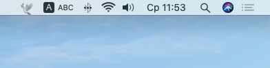
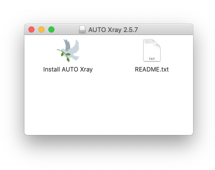

<p align="center">
  
</p>

<h1 align="center">AUTO Xray</h1>

<p align="center">
  Lightweight VLESS/Reality client for older Intel Macs that are no longer supported by modern clients.
</p>

<p align="center">
  <strong>English</strong> · <a href="README.ru.md">Русский</a>
</p>

<p align="center">
  
  
  
  
</p>

> **AUTO Xray 2.5.20 — Stable**  
> Tested on a real Intel Mac `x86_64` running macOS Catalina 10.15.x.

## Download

**Current stable version: AUTO Xray 2.5.20**

[**Download DMG — recommended**](https://github.com/eigenheit/auto-xray/releases/download/v2.5.20/AUTO_Xray_Catalina_v2.5.20.dmg)

Fallback option: [ZIP installer](https://github.com/eigenheit/auto-xray/releases/download/v2.5.20/AUTO_Xray_Catalina_Installer_v2.5.20.zip) · [SHA256SUMS.txt](https://github.com/eigenheit/auto-xray/releases/download/v2.5.20/SHA256SUMS.txt)

Do not download AUTO Xray from third-party websites or file-sharing services.

## Features

- VLESS + Reality through bundled **Xray-core 1.8.4**;
- automatic RF / EU / World node selection;
- manual selection of a specific server;
- HTTP/HTTPS proxy on `127.0.0.1:9001` and SOCKS5 on `127.0.0.1:2081`;
- automatic macOS system proxy configuration;
- recovery after Wi-Fi reconnects;
- protection against stale local proxies after shutdown;
- subscription updates from the menu;
- native macOS menu-bar workflow.

AUTO Xray works as a **system proxy client**, not as a TUN VPN.

## Screenshots





Screenshots were captured on a real Intel Mac running macOS Catalina.

## Installation

1. Download `AUTO_Xray_Catalina_v2.5.20.dmg`.
2. Open the DMG and launch **Install AUTO Xray.app** using `Control-click → Open`.
3. If Catalina initially shows only Cancel, click Cancel and open the installer again.
4. After installation, AUTO Xray starts in the **OFF** state.

Full installation guide: [docs/INSTALLATION.md](docs/INSTALLATION.md) *(currently in Russian; English docs are planned)*

## First run

Click 🕊:

1. **Update subscription**.
2. Choose RF / EU / World or a manual server.
3. Click **Enable**.

Bright dove = ON. Translucent dove = OFF.

## Release security

- Xray-core is verified by SHA-256 before packaging;
- every release includes SHA256SUMS;
- CI validates the build and installer packages;
- public DMG and ZIP packages do not contain diagnostic test tools.

## Limitations

- official target: Intel Mac + macOS Catalina 10.15.x;
- Apple Silicon is not a target of this release;
- the app is not currently signed with an Apple Developer ID and therefore uses the standard Gatekeeper flow;
- applications that ignore the system proxy may not use AUTO Xray.

If macOS reports malware or says the app "will damage your computer", do not bypass the warning.

## Data

Settings:

```text
~/Library/Application Support/AUTO Xray/
```

Logs:

```text
~/Library/Logs/AUTO Xray/
```

## Help

- [Installation](docs/INSTALLATION.md) *(Russian)*
- [Troubleshooting](docs/TROUBLESHOOTING.md) *(Russian)*
- [FAQ](docs/FAQ.md) *(Russian)*
- [Security](SECURITY.md)

Do not publish subscription URLs, UUIDs, Reality keys, or HWIDs in Issues.
